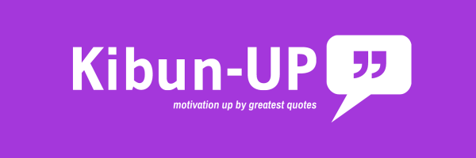
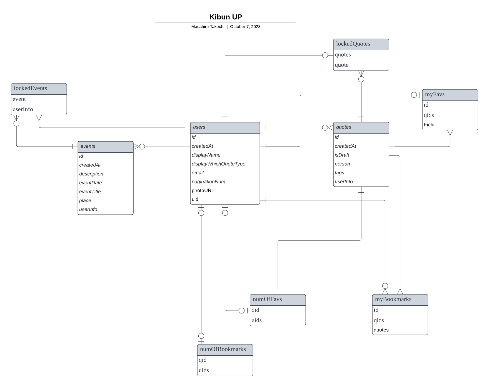

> 🚨 This is a README file in Japanese.
> An English Version of the Readme is [here](./README-English.md).
>
> 🚨 これは日本語版 README です。
> 英語版 README は[こちら](./README-English.md)です。

 

## 🔗 アプリの URL

「文章はいいから、アプリをすぐに試したい！」方のために URLを載せておきます。
https://kibun-up.vercel.app

🔻 ぜひ、アプリの概要、機能などの詳細もご覧ください 🔻
 
## 💻 使用技術

  
  
  
  
  
  
  

<!-- 言語、フレームワーク、ミドルウェア、インフラの一覧とバージョンを記載 -->

| 言語・フレームワーク      | バージョン   |
| --------------------- | ---------- |
| React                 | 18.2.0     |
| Next.js               | 13.4.4    |
| typescript            | 5.0.4      |

その他のパッケージのバージョンは package.json を参照してください。

## 💬 サービスへの想い
私は世界中の名言が大好きで、自分自身を励まし、人生の目標に向かって一生懸命頑張るためによく読みます。好きな名言のカテゴリは、スティーブ・ジョブズやソクラテスなどの過去の偉人たちのものから、日本のアニメキャラクターまでさまざまです。

## ❓ 誰のどんな問題を解決するか？
現在、何かしらの形で名言を表示するアプリはいくつかあり、自分も利用させてもらっています。ただ、どれも私の**すべての希望**を満たしていませんでした。

個人的な不満点は以下の通りです：
- ユーザーが名言を作成・編集できない
- 好きな名言を固定化できない
- ホーム画面に表示される名言がアプリ仕様でランダム
- かつ、ユーザーの好みに合わせて名言を表示してくれない
- 好きな名言のブックマークして見返せない
- 目標が1つしか設定できない

などです。もちろん良い点もあり、ユーザーは目標とその日付を設定するだけで非常に楽です。しかし、私のようなメモアプリに名言を残すくらい好きな人にとっては、自分の好きな名言を保存・表示・固定化させる機能は必要だと感じました。また、ユーザーは名言を作成できないので、名言を作成したい・メモアプリとして使いたいというユーザーには不向きです。

そこで、このアプリ、**Kibun UP**の登場です🙌　
このアプリでは、自、分の好きな名言を作成・表示・編集できるようになっています。また、目標を複数設定でき、その目標に向けてモチベーションを保つために、ホーム画面に表示される目標・名言をロックできます。ロックされているかどうかはひと目で分かるようになっており、ユーザー自身がアンロックするまで変わりません。また、イベント・名言をロックしない場合、ユーザーの好みに合わせてランダムに表示されます。そして何十個もの名言を入力するのが手間だという方のために、インターネットからランダムに名言を取得する機能もあります。

⭐️　このアプリでユーザーは以下のことができます：

- 名言・目標をを**複数作成**
- 表示したい名言と目標を**固定化**
- ロックされていない場合は**ランダムな名言と目標**が表示
- どの種類の名言を取得するか選択可能：
  - 自身
  - ブックマーク
  - インターネット経由
- 後で見返したい名言を**ブックマーク**
- 特定の目標に向けて、毎日残日数を確認し、**モチベーションアップ**

Kibun UPの由来は、自分がアメリカ留学をしているに最中によく飲んでいたで有名な炭酸「7 UP」です。セブンと気分の音が似ているので、このアプリの名前を「Kibun UP」にしました。

一番好きなアニメの名言は、「やはり俺の青春ラブコメはまちがっている」の雪ノ下雪乃の名言です。
>「その認識を改めなさい。
最低限の努力もしない人が才能ある人を羨む資格なんてないわ。
成功できない原因は成功者が積み上げてきた努力を想像できないから成功しないのよ」

 

## 🙈 環境変数

| 変数名         | 役割　 |
| ------------ | -------- |
| NEXT_PUBLIC_FIREBASE_API_KEY             | Firebase の設定           |
| NEXT_PUBLIC_FIREBASE_AUTH_DOMAIN         | Firebase の設定           |
| NEXT_PUBLIC_FIREBASE_PROJECT_ID          | Firebase の設定           |
| NEXT_PUBLIC_FIREBASE_STORAGE_BUCKET      | Firebase の設定           |
| NEXT_PUBLIC_FIREBASE_MESSAGING_SENDER_ID | Firebase の設定           |
| NEXT_PUBLIC_FIREBASE_APP_ID              | Firebase の設定           |
| NEXT_PUBLIC_FIREBASE_MEASUREMENT_ID      | Firebase の設定           |
| NEXT_PUBLIC_EMAILJS_USER_ID              | EmailJS のユーザー ID     |
| NEXT_PUBLIC_EMAILJS_SERVICE_ID           | EmailJS のサービス ID     |
| NEXT_PUBLIC_EMAILJS_TEMPLATE_ID 　       | EmailJS のテンプレート ID |

 

## 🖼️ アプリのスクリーンショット

### 概要

| [ホーム画面](https://kibun-up.vercel.app/)      | [ロック後](https://kibun-up.vercel.app/)    |
| ------------------------------- | ------------------------------ |
|  |  |
| ホーム画面、目標、名言                            | 目標と名言の両方をロックした後（赤いターゲットアイコン）   |

| [名言リスト](https://kibun-up.vercel.app/quote)          | [自分の名言以外の名言リスト](https://kibun-up.vercel.app/quote)             | [フィルターを使用した名言](https://kibun-up.vercel.app/quote)            | [名言登録フォーム](https://kibun-up.vercel.app/quote/register)     |
| -------------------------------------------------------- | --------------------------------------------------------------------------- | ------------------------------------------------------------------------ | ------------------------------------------------------------------ |
|  |  |  |  |
| 現在のユーザーが作成した名言のリスト                     | 他のユーザーが作成した名言のリスト                                          | 現在のユーザーが作成した名言のリスト                                     | 他のユーザーが作成した名言のリスト                                 |

| [目標リスト](https://kibun-up.vercel.app/event)      | [目標登録フォーム](https://kibun-up.vercel.app/event/register)     |
| -------------------------------------------------------- | ---------------------------------------------------------------------- |
|  |  |
| 現在のユーザーが作成した目標のリスト                 | 他のユーザーが作成した目標のリスト                                 |

| [プロフィールトップ](https://kibun-up.vercel.app/user/profile/[uid]) | [設定](https://kibun-up.vercel.app/user/profile/[uid]) |
| -------------------------------------------------------------------- | ------------------------------------------------------ |
|  |    |
| 現在のユーザーが作成した名言のリスト                                 | 他のユーザーが作成した名言のリスト                     |

| ログイン                                                              |
| --------------------------------------------------------------------- |
|                    |
| Google アカウントのみ許可（アップデートが近日中に予定されています!!） |

| [お問い合わせ](https://kibun-up.vercel.app/contact)                     | [クリエイター情報](https://kibun-up.vercel.app/creator-info)                                   |
| ----------------------------------------------------------------------- | ---------------------------------------------------------------------------------------------- |
|  |                         |
| ユーザーは直接メールを送信できます！                                    | クリエイター情報、アプリの技術スタック、履歴書、トランスクリプト、ソーシャルメディアアカウント |

 

### 詳細な概要

### 1. ホームページ

#### 機能: リフレッシュ

ユーザーはカードの右下にあるリフレッシュアイコンをクリックして、目標/名言をリフレッシュできます。

#### 機能: ロック

**ロック前**
カードの右下に配置された両方のターゲットアイコンは最初は灰色になっています。ユーザーが目標/名言をロックすると、そのアイコンは赤色になります。ユーザーはターゲットアイコンをクリックして目標/名言をロックできます。

**ロック後**
一度ロックすると、目標/名言はユーザーがアンロックするまで変わりません。ユーザーは再度ターゲットアイコンをクリックしてアンロックできます。

### 2. 名言ページ

**ユーザーの名言のリスト**
「Mine」タブの下にユーザーが作成した名言のリスト、「All」タブの下に他のユーザーが作成した名言のリストが表示されます。
カード内で以下の操作が可能です：
編集：カードの左下にある編集アイコン
ロック：カードの左下にあるロックアイコン
ハート：他のユーザーの名言へのいいねの数
削除：カードの右下にあるゴミ箱アイコン

**名言の登録フォーム**
右下のプラスアイコンをクリックすると、名言の登録フォームが表示されます。フォームを記入して新しい名言を作成できます。フォームは以下のルールで検証されます。
| プロパティ | ルール |
|-------------|------------------------- |
| 人物名 | 2 ~ 100 文字 |
| 説明 | 最大 1000 文字 |
| 下書き | ブール値 |
| タグ | 最大 5 つのタグ、最大 30 文字 |

**自分の名言以外の名言のリスト**
他のユーザーが作成した名言を表示します。ユーザーはカードの左下にあるハートアイコンをクリックして名言にいいねを付けることができます。また、ブックマークアイコンをハートアイコンの隣にクリックして名言をブックマークできます。ブックマークはプロフィールページの**ブックマーク**タブに表示され、ユーザーがプロフィールページで設定した場合、ホームページにも表示されます。

**フィルターを使用した場合の自分の名言のリスト**
ユーザーはタグで名言をフィルタリングし、リストを名言、人物、作成日時でソートできます。

### 3. 目標ページ

**目標リスト**
「Mine」タブの下にユーザーが作成した目標のリスト。作成時には、目標のタイトル、目標日付、目標場所、説明を設定できます。
カード内で以下の操作が可能です：
編集：カードの左下にある編集アイコン
ロック：カードの左下にあるロックアイコン
削除：カードの右下にあるゴミ箱アイコン

**目標登録フォーム**

ユーザーはフォームを記入して新しい目標を作成できます。フォームは以下のルールで検証されます。
| プロパティ | ルール |
|-------------|--------------------|
| 目標タイトル | 2 ~ 100 文字 |
| 場所 | 最大 50 文字 |
| 説明 | 最大 500 文字 |
| 目標日付 | 正しい日付形式 |

### 4. ユーザープロフィール

現在のユーザーに関連するもののリストを表示します。ユーザーはプロフィールセクションの右上にある編集アイコンをクリックしてプロフィールを編集できます。編集可能なものは、ユーザー名、プロフィール写真、1 ページあたりのアイテム数です。

#### 機能: 一度に表示するアイテム数をカスタマイズ

目標と名言のリストに対してページネーションを実装し、デフォルトで 1 ページに表示するアイテム数は 10 です。ユーザーは 1 ページに表示するアイテム数をカスタマイズでき、これによりユーザーの好みにアプリが変化します。したがって、例えば 5 にすると 1 ページに 5 つのアイテムが表示されます。

ユーザーはここからも自分の名言と目標を編集できます。また、ログインユーザーがブックマークした名言といいねした名言は、**ブックマーク**および**いいね**タブの下に表示されます。

#### 機能: ホームページに表示する名言の種類をカスタマイズ

デフォルトでは**自分の名言**が選択されており、ホームページに表示される名言はログインユーザーが作成した名言から選ばれます。他のオプションは「ブックマーク」および「ランダム」です。**ブックマーク**が選択された場合、ホームページに表示される名言は現在のユーザーがブックマークした名言から、**ランダム**が選択された場合、ホームページに表示される名言はインターネットからランダムに取得されます。

### 5. お問い合わせページ

ユーザーはフォームを記入してアプリのクリエイターに連絡できます。フォームは以下のルールで検証されます。
| プロパティ | ルール |
|----------|-------|
| 送信者名 | 2 ~ 20 文字 |
| 送信者メール | 正しいメール形式 |
| タイトル | 2 ~ 30 文字 |  
| メッセージ | 2 ~ 1000 文字 |

## 📊 ERD

## 😀 クリエイター

  

    
    

      アカウント
      

        
        
        
      

    

  

  

    竹内将大
    
日本の高知出身（日本語）。2019年9月から2021年5月までアーカンソー州の大学に通い、その後、2021年9月にBYU-Idahoに転校しました。専攻はコンピューターサイエンスで、卒業予定月は2024年12月です。ソフトウェアエンジニアまたはフロントエンド開発者としてのインターンシップを探しています。お気軽にソーシャルメディアアカウントを通じてお問い合わせください！

  

 

## ✌️ 将来のアップデート

- [ ] タグからランダムに選択する設定の追加
- [ ] 自分の名言をブックマークできるようにする
- [ ] プロフィールでの総いいね数の表示

## 🤝 サポート

機能リクエストやフォーク歓迎します！
このプロジェクトが気に入ったら ⭐️ をお願いします！

